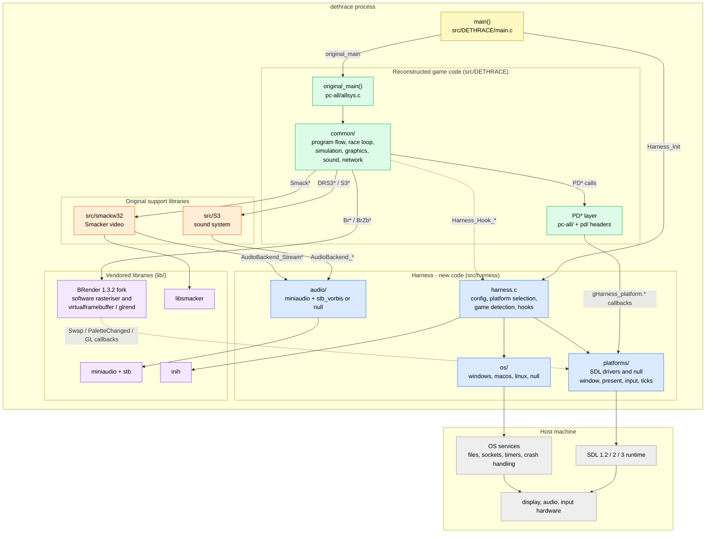

# Engine architecture

Dethrace rebuilds the 1997 Carmageddon engine as C source and runs it natively on modern
systems. It is not an emulator or a wrapper: the game logic is reimplemented function by
function and compared against the retail Windows 95 `CARM95.EXE` with
[reccmp](https://github.com/isledecomp/reccmp). Dethrace ships no game assets; it needs the
data of the original game or one of the freeware demos.

This page is the top-level map. Details live in the other documents:

- [CODE_LAYOUT.md](CODE_LAYOUT.md) - file-level layout of the repository
- [RENDERING_PIPELINE.md](RENDERING_PIPELINE.md) - framebuffer, palette and presentation details
- [CONFIGURATION.md](CONFIGURATION.md) - `dethrace.ini` keys and command-line options
- [PORTING.md](PORTING.md) - adding a new OS or windowing platform
- [TROUBLESHOOTING.md](TROUBLESHOOTING.md) - common failures
- [../reccmp/README.md](../reccmp/README.md) - the binary-matching workflow

## The two halves of the codebase

**Reconstructed original code** - `src/DETHRACE` (game logic, including the portable platform
layer in `pc-all/`), `src/S3` (sound) and `src/smackw32` (Smacker video API). This code is
written to resemble the 1997 sources and to compile into assembly comparable with the retail
binary; functions carry their original names and `// FUNCTION: CARM95 0x...` annotations.
Behavioral fixes and the 3dfx patch are wrapped in `DETHRACE_FIX_BUGS` and
`DETHRACE_3DFX_PATCH`. `pc-dos/` and `pc-win95/` are kept for reference and are not compiled;
the only exception is `pc-win95/win95net.c`, which the reccmp build uses.

**Harness** - `src/harness`: all new cross-platform code written by the dethrace project
(configuration, game detection, windowing and input, OS services, audio backend, logging).
New platform code belongs here. The game code reaches it through the `PD*` API, direct hooks
and the `AudioBackend_*` interface.

The process entry point is dethrace glue and lives in `src/DETHRACE/main.c`: it calls
`Harness_Init`, then the renamed original entry point `original_main`
(`src/DETHRACE/pc-all/allsys.c`), then `Harness_Quit`.

`lib/` contains the vendored third-party libraries: the BRender v1.3.2 fork (git submodule;
renderer), miniaudio and stb (audio and OGG decoding), libsmacker (Smacker decoding) and inih
(INI parsing).

## Technology stack

### Original 1997 stack

| Concern | Original |
|---|---|
| Language and build | C for DOS and Windows 95; the retail `CARM95.EXE` (16 October 1997) was built with Microsoft Visual C++ 4.2; names come from a Watcom debug-symbol dump of an earlier internal build (`DETHRSC.SYM`) |
| Rendering | BRender v1.3.2 (Argonaut Software): 8-bit paletted software rasteriser, later a 3dfx Voodoo/Glide build (`VOODOO2C.EXE`) |
| Audio | S3 (the game's original sound library) with SOS (DOS) and DirectSound (Win95) backends; CD audio |
| Video | RAD Smacker (`smackw32`) for cutscenes; an FLI/FLIC player (`flicplay.c`) for interface animations |
| Networking | IPX |
| Platform | DOS and Win32 APIs behind the `pd/` layer |

### Modern Dethrace stack

| Concern | Dethrace |
|---|---|
| Language and build | C only (no C++); CMake >= 3.20; MSVC, GCC or Clang; Debug is the default configuration; CPack packaging and GitHub Actions CI |
| Windowing and input | SDL 1.2, 2 or 3 drivers (`src/harness/platforms/`), selectable at build time; SDL2 is the default build; multiple drivers can be compiled and chosen at runtime; SDL can also be loaded dynamically; a null driver is used by tests |
| Rendering | BRender v1.3.2 fork. Default: software rasteriser into a `virtualframebuffer` device. Optional: the `glrend` OpenGL device for 3dfx emulation (`--opengl`) |
| Audio | miniaudio and stb_vorbis behind `AudioBackend_*`, including GOG-style `MUSIC/TrackNN.ogg` CD tracks; a null backend when sound is disabled |
| Video | libsmacker |
| OS services | `src/harness/os/`: files, sockets, preferred paths and crash handling per host OS |
| Config | `dethrace.ini` parsed with inih, overridden by command-line options |
| Tests | Unity tests run through CTest; `dethrace_test` links the same game object library and uses the null platform |
| Fidelity | reccmp against `CARM95.EXE`, plus an MSVC 4.2 build under Docker/Wine for comparable code generation |

## Architecture diagram

Solid arrows are direct calls; dashed arrows are calls made through function-pointer tables
(harness hooks and BRender device callbacks). Colors: yellow = entry glue, blue = harness (new
code), green = reconstructed game code, orange = original support libraries, purple = vendored
libraries, grey = host. Compile-time options change which platform drivers and audio backends
exist; see "Build flavours and options" below.

## How the program runs

### Startup

1. `main()` (`src/DETHRACE/main.c`) attaches a console on Windows and calls
   `Harness_Init(&argc, argv)`.
2. `Harness_Init` (`src/harness/harness.c`) applies defaults (60 FPS limit, CD check disabled,
   and so on), loads `dethrace.ini` through inih, applies command-line overrides and strips
   harness-only flags from `argv`, selects a platform driver whose capabilities match the
   requested mode, installs the crash handler, resolves the working directory (game directory
   from the ini or command line, `DETHRACE_ROOT_DIR`, the executable directory, or the SDL
   pref path) and detects the game edition (Carmageddon, Splat Pack, or a demo) and the
   localization from the data files.
3. `main()` calls `original_main()` (`src/DETHRACE/pc-all/allsys.c`), the renamed original
   entry point. It parses the original flags (`-hires`, `-nosound`, ...) and calls `GameMain`.
4. `GameMain` (`src/DETHRACE/common/main.c`) sets up paths and diagnostics, optionally checks
   for the game CD, and runs `InitialiseDeathRace` (`src/DETHRACE/common/init.c`):
   `PDInitialiseSystem` (keyboard, joysticks, ASCII tables) followed by
   `InitialiseApplication` (BRender start-up, options, fonts, palettes, screen buffers, sound,
   races, opponents, power-ups).
5. The window and the BRender device are created here, not in `Harness_Init`:
   `PDAllocateScreenAndBack` (`src/DETHRACE/pc-all/allsys.c`) calls
   `gHarness_platform.CreateWindow_` and `BrDevBeginVar` with either `virtualframebuffer`
   (the default software mode) or `glrend` (`--opengl`).
6. `InitialiseApplication` ends in `DoProgram` (`src/DETHRACE/common/structur.c`), the outer
   state machine that runs until the program quits.

### Program flow

`DoProgram` dispatches on `gProgram_state.prog_status`:

- `eProg_intro` - logo movies (`DoLogos`)
- `eProg_opening` - opening animation (`DoProgOpeningAnimation`)
- `eProg_idling` - main menu or loading a save (`DoMainMenuScreen`, `DoLoadGame`)
- `eProg_demo` - attract slideshow for demo editions (`DoProgramDemo`)
- `eProg_game_starting` - `DoGame`: race and opponent selection, loading, `InitRace`, grid
  position, `DoRace`, post-race summary; afterwards the state either returns to `eProg_idling`
  or starts another race

`DoGame` calls `DoRace` (`src/DETHRACE/common/mainloop.c`), which enters `MainGameLoop`.

### The race loop and a frame

Each `MainGameLoop` iteration (`src/DETHRACE/common/mainloop.c`):

1. Poll input (`CyclePollKeys`, `CheckSystemKeys`) and receive network messages.
2. Service the game (`ServiceGameInRace`): window messages through `PDServiceSystem`,
   network, memory housekeeping.
3. Measure the elapsed time (`UpdateFramePeriod`) into `gFrame_period`.
4. Simulate: power-ups, palette animation, opponent AI, player controls, car physics, car
   piping, checkpoints, cameras, car graphics, wheel damage, pedestrians, HUD, oil, shrapnel
   and skid marks, depth effects.
5. Audio is serviced from the simulation (engine noise and sound services) down to S3 and
   `AudioBackend_*`.
6. Render a frame with `RenderAFrame` and present it.
7. Handle the in-race menu (Escape), action replay and net-game management; end when the race
   finishes or is abandoned.

Physics runs on the original 40 ms step (`PHYSICS_STEP_TIME`); the optional `PhysicsPerFrame`
setting runs it once per frame instead, and dt-scaled hooks keep effects visually equivalent.

A frame is composed in 8-bit paletted pixelmaps: `RenderAFrame`
(`src/DETHRACE/common/graphics.c`) draws the 2D background into `gBack_screen`, BRender renders
the 3D scene into `gRender_screen` (plus a rear-view pass), then the 2D foreground and HUD are
drawn into `gBack_screen`. `PDScreenBufferSwap` reaches `BrPixelmapDoubleBuffer`, and the
BRender device invokes the registered `Swap` callback; the platform driver converts the 8-bit
image with the palette, presents it and applies the FPS limit. Palette-only changes are
re-presented from the last frame without re-rendering the scene. See
[RENDERING_PIPELINE.md](RENDERING_PIPELINE.md).

Shutdown goes through `QuitGame` (`src/DETHRACE/common/main.c`), which stops demo mode,
network, sound and BRender and calls `PDShutdownSystem`; that destroys the window and calls
`exit()`. `Harness_Quit` normally runs only when `original_main` returns early.

## Component contracts

- **Platform driver** - `tHarness_platform` in `src/harness/include/harness/hooks.h`: window
  creation, buffer swap, palette changes, keyboard state, mouse, timing, cursor, error dialogs
  and OpenGL entry points. A driver exports a `tPlatform_bootstrap` (name, description,
  capability bits, `init`); the harness selects the first compiled driver that supports the
  requested mode (`--opengl` requires the OpenGL capability and 3dfx assets). SDL2 is the
  default build; when several SDL drivers are compiled, `sdl3`, then `sdl2`, then `sdl1` are
  tried. The null platform is not user-selectable; tests force it with
  `Harness_ForceNullPlatform`, and it does not present frames.
- **PD layer** - the original platform-dependent API (`pd/sys.h`, `pd/net.h`), implemented for
  modern builds in `pc-all/allsys.c` (system) and `pc-all/allnet.c` (network, UDP/IP instead of
  IPX). The implementation forwards to `gHarness_platform` and the harness OS layer. Networking
  is partial: several `PDNet*` entry points are not implemented.
- **OS layer** - `src/harness/include/harness/os.h`: `OS_fopen` and directory helpers,
  preferred paths, socket helpers, console password, and the signal/stack-trace handler.
  Exactly one implementation is compiled (`os/windows.c`, `os/macos.c`, `os/linux.c`, or the
  stub `os/null.c` in the reccmp build).
- **Audio backend** - `src/harness/include/harness/audio.h`: `AudioBackend_*` is used by S3,
  and `AudioBackend_Stream*` by smackw32 for cutscene soundtracks. Implemented by miniaudio and
  stb_vorbis, or by a null backend when sound is disabled.
- **Hooks** - one-off functions called from reconstructed code: `Harness_Hook_fopen` (file open
  with fallbacks), `Harness_Hook_isalnum` (localized text), and the dt-scaling hooks used by
  physics-per-frame.
- **BRender callbacks** - the game registers `Swap` and `PaletteChanged` (software device) or
  the GL callback set (`--opengl`) into the BRender device; BRender invokes them when
  presenting.

## Build flavours and options

| Flavour / option | Effect |
|---|---|
| Default build | `BUILD_TESTS=OFF`, `DETHRACE_FIX_BUGS=ON`, `DETHRACE_3DFX_PATCH=ON`, `DETHRACE_SOUND_ENABLED=ON`, SDL2 driver, Debug configuration |
| Platform drivers | `DETHRACE_PLATFORM_SDL1/SDL2/SDL3`; at least one is required; with two or more, dynamic SDL loading is forced |
| Sound | `DETHRACE_SOUND_ENABLED=OFF` replaces miniaudio with the null audio backend |
| Networking | `DETHRACE_NET_ENABLED` is declared but currently unused; network code always builds (`pc-all/allnet.c`, or `pc-win95/win95net.c` in the reccmp build) |
| `MSVC_42_FOR_RECCMP` | Compile-only target producing `CARM95.exe` with MSVC 4.2 for reccmp: platform, sound, network, bug fixes and 3dfx support are disabled and the BRender drivers are not built. It is not runnable |
| Tests | `BUILD_TESTS=ON` builds `dethrace_test` (Unity) and registers CTest; the test executable forces the null platform and most tests need `DETHRACE_ROOT_DIR` pointing at game data |

The option declarations in `CMakeLists.txt` are the source of truth; runtime options are
documented in [CONFIGURATION.md](CONFIGURATION.md).

## Binary fidelity

Each reconstructed function carries the address it had in the retail binary
(`// FUNCTION: CARM95 0x...`). CI builds the `MSVC_42_FOR_RECCMP` target and runs
[reccmp](https://github.com/isledecomp/reccmp) against `CARM95.EXE` (pinned by hash in
`reccmp-project.yml`), publishing a per-function match report; pull requests that lower the
score are flagged. This is why code under `src/DETHRACE` can look compiler-shaped and unusual.
See [reccmp/AGENTS.md](../reccmp/AGENTS.md) for the matching rules.

## Where to change what

| Goal | Location |
|---|---|
| Fix a bug in original game logic | `src/DETHRACE/...`, wrapped in `DETHRACE_FIX_BUGS` |
| Change windowing, input or presentation, or add a platform | `src/harness/platforms/`, then [PORTING.md](PORTING.md) |
| Change file paths, sockets or crash handling | `src/harness/os/` |
| Change audio output | `src/harness/audio/` (S3 calls `AudioBackend_*`) |
| Work on binary matching | `reccmp/`, build with `MSVC_42_FOR_RECCMP=ON` |
| Add or adjust tests | `test/` (links `dethrace_obj`, null platform) |
| Change runtime settings | `src/harness/harness.c`, then [CONFIGURATION.md](CONFIGURATION.md) |

## See also

- [CODE_LAYOUT.md](CODE_LAYOUT.md) - repository layout, file by file
- [RENDERING_PIPELINE.md](RENDERING_PIPELINE.md) - rendering; note that its "OpenGL
  implementation" section describes an earlier design that predates the current BRender
  `glrend` / `virtualframebuffer` integration
- [CONFIGURATION.md](CONFIGURATION.md) - `dethrace.ini` and the command line
- [PORTING.md](PORTING.md) - adding an OS or platform
- [TROUBLESHOOTING.md](TROUBLESHOOTING.md) - common problems
- [../reccmp/README.md](../reccmp/README.md) - running the binary diff
- [../CONTRIBUTING.md](../CONTRIBUTING.md) - project goals and contribution rules
